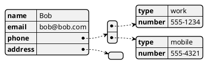
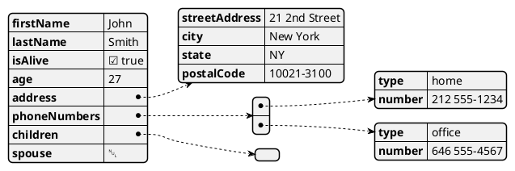
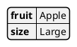
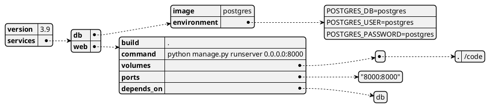
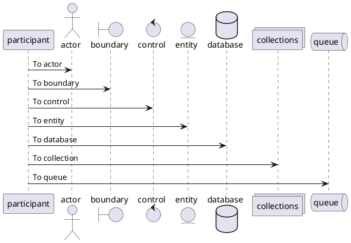

+++
title = "PlantUML"
author = ["Christopher James Hayward"]
lastmod = 2021-02-04T14:39:22-05:00
draft = false
+++

As described by the webiste[^fn:1]:

> **PlantUML** is a component that allows you to quickly write UML and other data diagrams, using a simple and intuitive language.

## Display JSON data {#display-json-data}

You can use the JSON format with PlantUML to visualize your data, to activate the feature the diagram must use the `@startjson` and `@endjson` tags, respectively[^fn:2].

```plantuml
@startjson
"Hello world!"
@endjson
```



### Simple example {#simple-example}

Here's an example of a `user` object, with an accompanying `address` and list of `phone` numbers:



### Complex example {#complex-example}

Here is the example of a complex data structure[^fn:2], which comes from the Wikipedia page for JSON[^fn:3]:



## Display YAML data {#display-yaml-data}

Much like JSON, PlantUML can visualize YAML data using the `@startyaml`, and `@endyaml` keywords[^fn:4]:



### Docker example {#docker-example}

Here's an example docker compose file running with a simple application structure[^fn:5]:



## Sequence Diagram {#sequence-diagram}

Here's the complete example[^fn:6] showing many participants.



Here's a list of all the available keywords:

-   actor
-   boundary
-   control
-   entity
-   database
-   collections
-   queue

## Resources {#resources}

[^fn:1]: PlantUML Website <https://plantuml.com>
[^fn:2]: PlantUML JSON Data <https://plantuml.com/json>
[^fn:3]: Wikipedia entry for JSON <https://en.wikipedia.org/wiki/JSON>
[^fn:4]: PlantUML YAML Data <https://plantuml.com/yaml>
[^fn:5]: Docker compose documentation <https://docs.docker.com/compose/django/>
[^fn:6]: PlantUML Sequence Diagrams <https://plantuml.com/sequence-diagram>
